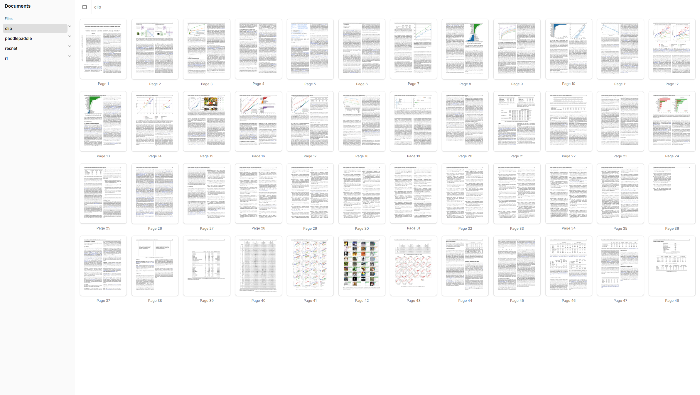
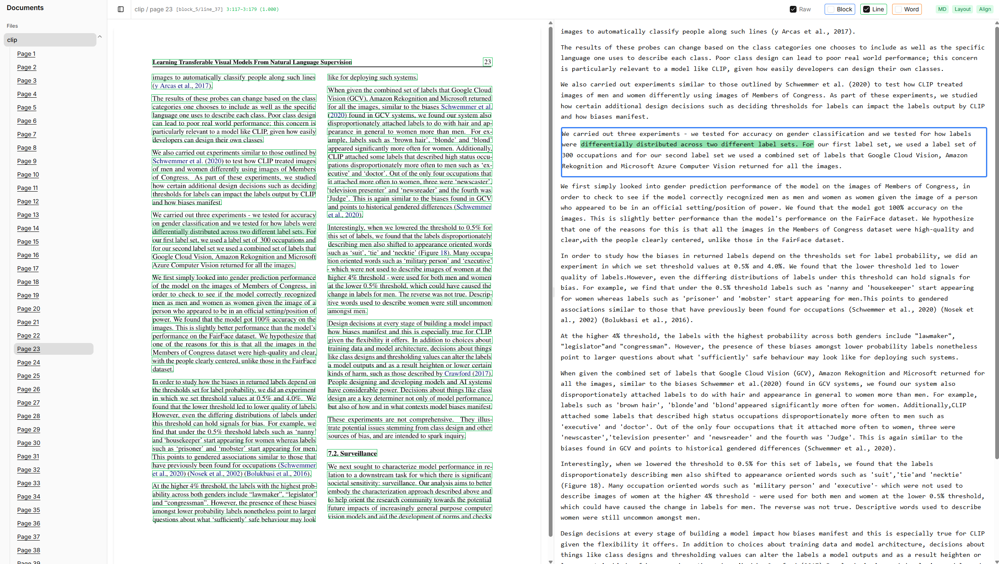
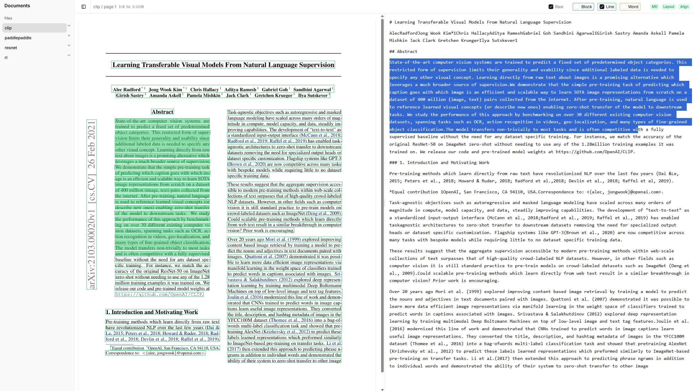

# ppx-dev

Document analysis pipeline: OCR a PDF, build semantic alignments between the visual layout and the markdown AST, and explore the results in an interactive viewer.


_Hovering over a visual token automatically highlights the corresponding markdown span, bridging the visual and semantic gap._

📄 **[Read the Full Manuscript Here](https://dbresearch-ontariotech.github.io/ppx-paper/)**

## Overview

Navigating the boundaries between vast document spaces—textbooks, papers, and articles—and abstract concepts represents the grand challenge of agentic knowledge distillation. To help humanity learn faster, AI agents need specialized tools to traverse these layers. A critical missing link is the exact alignment between raw information (source text) and structured text (Markdown), which is essential for agents to translate raw data into actionable concepts and abstractions.

This thesis tackles this specific bottleneck by focusing on the navigation mechanism between documents and information. I introduce the Parsed Page eXplorer, a foundational tool that facilitates agentic learning through strict alignment between source text and Markdown. Establishing this foundation with semantic provenance empowers AI agents to seamlessly bridge the gap from documents to accessible information. Ultimately, this mechanism provides the foundation for highly efficient, agent-driven human knowledge distillation.

## Pipeline Architecture

```
ppx-ocr   →   ppx-align build   →   ppx-align serve
                                           ↑
                                      ppx-svelte (browser)
```

---

## Prerequisites

- Python ≥ 3.10 with [uv](https://docs.astral.sh/uv/)
- Node.js ≥ 18 with [pnpm](https://pnpm.io/) (for the Svelte client)
- CUDA-capable GPU (required by PaddleOCR)

---

## Step 1 — OCR a PDF (`ppx-ocr`)

Install dependencies (first time only):

```bash
cd ppx-ocr
make install
```

Run OCR on a PDF file:

```bash
uv run ppx-ocr -o ../output/ path/to/mydoc.pdf
```

This produces one subdirectory per page under `../output/mydoc/`:

```
output/mydoc/
  0/    ← page 0
  1/    ← page 1
  ...
```

Each page directory contains the page image, extracted markdown, and raw OCR data.

Options:

| Flag          | Description                               |
| ------------- | ----------------------------------------- |
| `-o PATH`     | Output directory (required)               |
| `--overwrite` | Re-process pages that already have output |

---

## Step 2 — Build alignments (`ppx-align`)

Install dependencies (first time only):

```bash
cd ppx-align
make install
```

Build the layout tree and semantic alignment for all pages:

```bash
uv run ppx-align build ../output/mydoc
```

To process a single page (useful during development):

```bash
uv run ppx-align build ../output/mydoc --page 0
```

To skip line-level alignment and only align blocks:

```bash
uv run ppx-align build ../output/mydoc --blocks-only
```

---

## Step 3 — Start the API server (`ppx-align serve`)

The server exposes the OCR and alignment data over HTTP and is required by the Svelte client.

```bash
uv run ppx-align serve ../output
```

The server starts on port 8000 by default. To use a different port:

```bash
uv run ppx-align serve ../output --port 9000
```

The `output` directory should be the **parent** of the per-document directories — the server discovers all documents inside it automatically.

To simulate a slow connection (useful for testing loading states in the UI):

```bash
uv run ppx-align serve ../output --slow
```

---

## Step 4 — Start the viewer (`ppx-svelte`)

In a separate terminal:

```bash
cd ppx-svelte
pnpm install        # first time only
pnpm dev
```

Open [http://localhost:5173](http://localhost:5173) in a browser.

The client proxies all `/api/ppx/...` requests to the server on port 8000. If the server is running on a different port, update `vite.config.ts` accordingly.

---

## Viewer features

Our Svelte-based viewer (`ppx-svelte`) allows you to interactively explore the alignments generated by the pipeline.

_Easily navigate through vast document spaces and select specific pages for granular inspection._

- **Two-panel layout**: page image on the left, markdown on the right
- **Visual token overlays**: enable Block / Line / Word bounding boxes with the checkboxes in the header

_Granular bounding boxes overlaying the original document text._

- **Hover alignment**: hovering a layout token highlights the corresponding markdown span; the right panel scrolls to it automatically
- **Raw source mode**: toggle **Raw** in the header to view the original markdown source instead of rendered HTML — enables text selection for reverse alignment
- **Selection tracking**: selecting text in raw source mode displays the `ast_index:char_offset` span in the header

---

## Viewer Features

Our Svelte-based viewer (`ppx-svelte`) allows you to interactively explore the alignments generated by the pipeline.

**Document Gallery**
_Easily navigate through vast document spaces and select specific pages for granular inspection._



**Interactive Alignment & Overlays**

- **Two-panel layout:** View the original page image on the left alongside the extracted and aligned markdown on the right.
- **Hover alignment:** Hovering a layout token highlights the corresponding markdown span; the right panel scrolls to it automatically.
- **Visual token overlays:** Enable Block, Line, or Word bounding boxes using the header checkboxes to see exactly how the OCR engine parsed the document.


_Granular bounding boxes overlaying the original document text, with the corresponding semantic block highlighted in the right panel._

**Advanced Source Inspection**

- **Raw source mode:** Toggle **Raw** in the header to view the original markdown source instead of rendered HTML. This enables text selection for reverse alignment.
- **Selection tracking:** Selecting text in raw source mode displays the `ast_index:char_offset` span in the header, allowing for precise debugging of the semantic provenance.


_Viewing the raw markdown source with word-level visual tokens enabled._

---

## Benchmarking

Evaluate alignment quality and its robustness to character-level noise. Produces cross-document distributions, precision / recall / F1 against a gold alignment, and per-noise diagrams.

```
ppx-bench corrupt   →   ppx-align build --noise   →   ppx-bench benchmark
```

Each page needs `layout-tree.parquet` and `alignment.json` first — i.e. Steps 1–2 above must have run.

### Quick start

Run the full pipeline (OCR → align → corrupt → noisy align → benchmarks) across every PDF in `samples/en/`:

```bash
cd ppx-bench
make install        # first time only
make all
```

Round-robin across GPUs detected by `nvidia-smi`. Defaults: `NOISE=0.01,0.02,0.03,0.04,0.05,0.1,0.2`, `SEED=42`. Override per target, e.g. `make all NOISE=0.005,0.05 SEED=7`.

### Manual

Inject synthetic character noise into aligned markdown spans:

```bash
uv run ppx-bench corrupt ../output/mydoc -n 0.01,0.05 --seed 42
```

Writes `markdown_<level>.md` to each page directory. Noise levels accept fractions (`0.05`) or percentages (`5`).

Build alignments against the corrupted markdown:

```bash
uv run ppx-align build ../output/mydoc --noise 0.01,0.05
```

Writes `alignment_<level>.json` per page.

Generate the benchmark reports:

```bash
uv run ppx-bench benchmark ../output                    # cross-document, uncorrupted
uv run ppx-bench noise-benchmark ../output              # line-score distributions per noise level
uv run ppx-bench precision-recall-benchmark ../output   # gold-vs-noise precision / recall / F1 / block error
uv run ppx-bench summary ../output                      # text summary of all three
```

Outputs:

- Per document: `output/<doc>/diagrams/`, `output/<doc>/noise_diagrams/`, `output/<doc>/precision_recall/`
- Cross document: `output/benchmark/`, `output/noise_benchmark/`, `output/precision_recall_benchmark/`

Each directory contains `.parquet` data files plus PNG plots.
